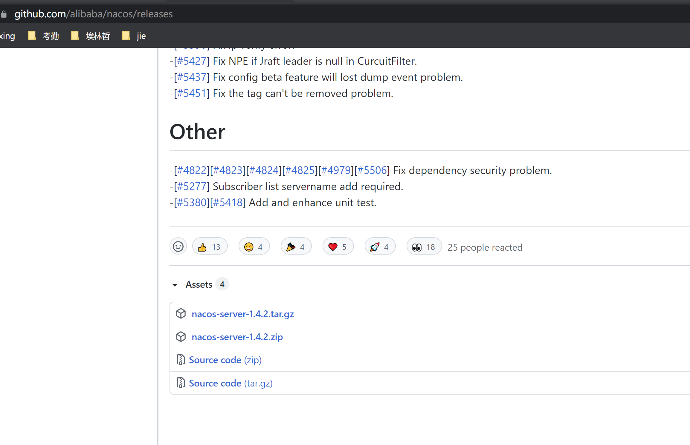
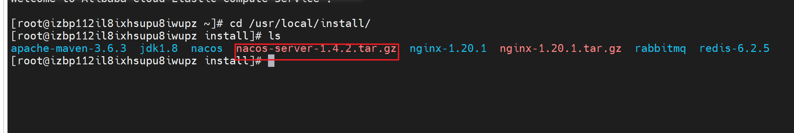
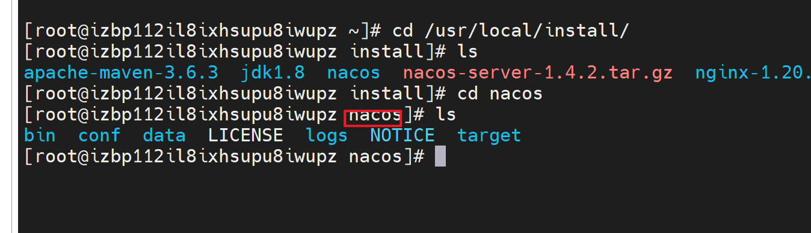
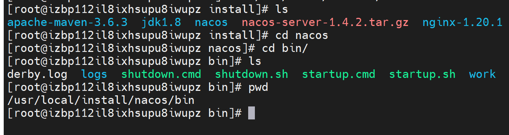

# Nacos

## 一、下载

下载地址：https://github.com/alibaba/nacos/releases



百度网盘下载地址：

链接：https://pan.baidu.com/s/15NJxGsdeNDwtWMb6ABy8_A
提取码：zvdb

## 二、解压

将下载好的压缩包利用文件传输工具上传到linux服务器指定位置（本机传到：/usr/local/install/）



```bash
tar -zxvf nacos-server-1.4.2.tar.gztar //解压nacos tar包
```

解压后：nacos



## 三、启动


1、切换到nacos/bin/目录下，并执行启动命令




```bash
sh startup.sh -m standalone //单机启动nacos
```

2、页面访问

在浏览器访问：http://ip:8848/nacos

